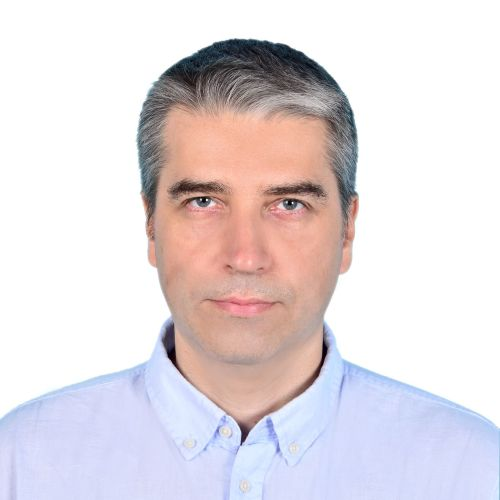

  

    <h1 class="name-header">Ilya M. Afanasyev, Ph.D.</h1>
    

      
    

    
Senior R&D Expert, Key Project Engineer & Adjunct Associate Professor

    <a href="https://github.com/afanasyspb" class="github-link">View My GitHub Profile</a>

    

      <a href="https://scholar.google.ru/citations?user=Ogv_bdYAAAAJ" target="_blank">Google Scholar</a>
      <a href="https://www.researchgate.net/profile/Ilya-Afanasyev-3" target="_blank">ResearchGate</a>
      <a href="https://ru.linkedin.com/in/ilya-afanasyev-8783291a" target="_blank">LinkedIn</a>
      <a href="mailto:ilya.afanasyev@gmail.com">Email</a>
    

  

  

    <h1>About Me</h1>

    
<strong>Ilya M. Afanasyev, Ph.D.</strong>, is a Senior R&D Expert and Key Project Engineer: a long-term external contractor engaged via IT consulting companies (Ventra, later Coleman Tech) to deliver research projects and technology expertise for their client, the <strong>Chebyshev Research Center (Huawei R&D, St. Petersburg)</strong>. Always an external expert, never a Huawei employee. He is also an Adjunct Associate Professor (Docent) at <strong>Innopolis University</strong>, Center for Top-Tier Educational Programs in AI. He earned his Ph.D. in Optical and Optoelectronical Devices from Vavilov State Optical Institute (2006).

    
With over two decades of R&D experience across industry and academia (Marie Curie fellowship at the University of Trento, Italy; TGT Oilfield Services; Giesecke & Devrient), he specializes in <strong>Autonomous Systems, Sensors, Computer Vision, and Mobile Robotics</strong>. His current work rests on three pillars: computational and algorithmic optimization of perception pipelines (GPU and CPU), the Julia programming language for scientific computing, and Geometric (Clifford) Algebra as a unified mathematical language for robotics.

    
He is a <strong>Marie Curie Fellow alumnus</strong>, holder of 2 patents, and author of 120+ publications (56 indexed in Scopus/WoS), with an h-index of 23 and about 2,000 citations (Google Scholar).

    <h2>📅 Experience Timeline</h2>

    

      
      
My academic and industrial career path (2000-2026). Click image to enlarge.

    

    <h2>🔬 Research Interests</h2>

    <ul class="research-list">
      <li><strong>Geometric (Clifford) Algebra:</strong> dual-quaternion geometric observers on SE(3), conformal geometric algebra for scene representation</li>
      <li><strong>State Estimation & Sensor Fusion:</strong> 6-DoF pose estimation, multi-radar/multi-camera calibration, IMU and visual odometry fusion</li>
      <li><strong>Mobile Robotics:</strong> SLAM, Navigation, Path Planning</li>
      <li><strong>Computer Vision:</strong> Object Detection, Tracking, Camera Calibration</li>
      <li><strong>Computational & Algorithmic Optimization:</strong> accelerating perception pipelines for GPU and CPU architectures</li>
      <li><strong>Julia for Scientific Computing:</strong> differentiable programming and rapid prototyping in robotics</li>
      <li><strong>Intelligent Systems:</strong> UAV, Intelligent Transportation Systems (ITS), Human-Computer Interaction</li>
    </ul>

    <h2>📚 Selected Publications & Patents</h2>

    
Please visit my <a href="https://scholar.google.ru/citations?user=Ogv_bdYAAAAJ" target="_blank">Google Scholar Profile</a> for the full list.

    

      A-level Conference Paper (Geometric Algebra in Sensor Fusion) 
      1. <strong>Geometric State Fusion for Autonomous Agents: A Comparative Analysis of Dual Quaternion Observer and Kalman Filters.</strong> 
      I. Afanasyev. 
      <em>Extended Abstract 1168, Proc. of the 25th International Conference on Autonomous Agents and Multiagent Systems (AAMAS 2026)</em>, May 25-29, 2026, Paphos, Cyprus, IFAAMAS, 2026, pp. 3480-3482. 
      <a href="https://doi.org/10.65109/CMZH8882" target="_blank">DOI: 10.65109/CMZH8882</a>, Project page: <a href="https://afanasyspb.github.io/SE3-Manifold-Lib/geodq.html" target="_blank">SE3-Manifold-Lib/GeoDQ</a>
    

    

      Most Cited (SLAM Benchmarking) 
      2. <strong>Comparison of Various SLAM Systems for Mobile Robot in an Indoor Environment.</strong> 
      M. Filipenko, I. Afanasyev. 
      <em>9th IEEE International Conference on Intelligent Systems (IS)</em>, 2018. 
      [Cited by ~300+] <a href="https://doi.org/10.1109/IS.2018.8710464" target="_blank">DOI</a>
    

    

      Lidar SLAM & Ground Truth Analysis 
      3. <strong>Map Comparison of Lidar-based 2D SLAM Algorithms Using Precise Ground Truth.</strong> 
      R. Yagfarov, M. Ivanou, I. Afanasyev. 
      <em>Int. Conference on Control, Automation, Robotics and Vision (ICARCV)</em>, Singapore, 2018. 
      [Cited by ~170+] <a href="https://doi.org/10.1109/ICARCV.2018.8581131" target="_blank">DOI</a>
    

    

      Intelligent Systems & IoT 
      4. <strong>Towards the Internet of Robotic Things: Analysis, Architecture, Components and Challenges.</strong> 
      I. Afanasyev, et al. 
      <em>12th International Conference on Developments in eSystems Engineering (DeSE)</em>, 2019. 
      [Cited by ~100] <a href="https://arxiv.org/abs/1907.03817" target="_blank">arXiv</a>
    

    

      Top Journal (UAV Efficiency) 
      5. <strong>Game Theory-based Parameter Tuning for Energy-efficient Path Planning on Modern UAVs.</strong> 
      D. Moolchandani, I. Afanasyev, et al. 
      <em>ACM Transactions on Cyber-Physical Systems</em>, Vol. 6(4), 2022. 
      <a href="https://doi.org/10.1145/3565270" target="_blank">DOI</a>
    

    

      Patents (Hardware & UAV) 
      6. <strong>Modular multi-rotor unmanned aerial vehicle of vertical take-off and landing.</strong> 
      M. Galimov, I. Afanasyev, et al. 
      <em>Patent RU 2706765</em>, 2019. 
      <a href="https://patents.google.com/patent/RU2706765C1/en" target="_blank">Google Patents</a>
    

    <h2>🎓 Teaching (Highlights)</h2>

    <ul class="research-list">
      <li><strong>Advanced Robotics</strong> (Master's level), Innopolis University (2025-2026)</li>
      <li><strong>Optoelectronic Detecting Technology</strong> and <strong>Condensed Matter Physics</strong>, ITMO & CUST (China), Changchun, 2025</li>
      <li><strong>Foundation of Robotics</strong> and <strong>Computer Vision with OpenCV</strong>, Kazan Federal University (2021-2022)</li>
      <li><strong>Sensors of Transport Systems</strong> and <strong>Graph Database and Data Management</strong>, SPbPU industrial track (2021-2023)</li>
      <li><strong>Sensors & Sensing</strong>, Innopolis University (2018-2020) and SPbPU (2021)</li>
      <li><strong>Intelligent Mobile Robotics</strong>, Innopolis University (2016-2020)</li>
      <li><strong>Control Theory</strong>, Innopolis University (2016-2019)</li>
      <li><strong>PhD supervision:</strong> Anvar Tliamov (since September 2025), mathematical modelling for robotics and multi-agent systems</li>
    </ul>

    <h2>🤝 Service to the Profession</h2>

    <ul class="research-list">
      <li><strong>Reviewer:</strong> IEEE T-ASE, IEEE RA-L, IFAC, IEEE CASE, IEEE Access, MDPI Sensors</li>
      <li><strong>Invited Speaker:</strong> IEEE ICARA 2023 (Abu Dhabi, UAE)</li>
      <li><strong>Session Chair:</strong> TOOLS 50+1 (Innopolis, 2019)</li>
    </ul>

    

      <small>Last updated: August 2026</small>
    

  

  &times;
  

