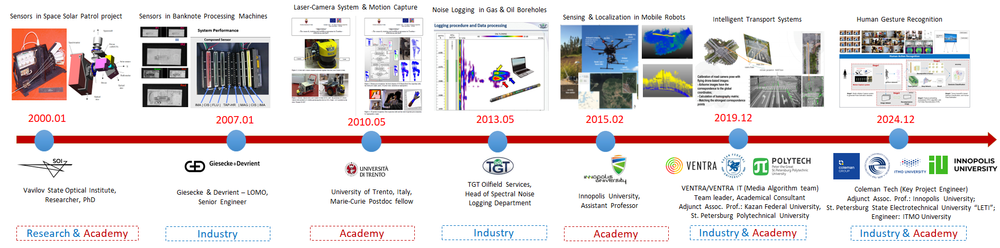

# About Me

**Ilya M. Afanasyev, Ph.D.**, is an Expert at the **Chebyshev Research Center (Huawei)** and an Adjunct Associate Professor at **Innopolis University** and **Saint Petersburg Electrotechnical University "LETI"**. He earned his Ph.D. in Optical and Optoelectronical Devices from Vavilov State Optical Institute (2006).

With over two decades of R&D experience, Dr. Afanasyev has worked in industry (Huawei, TGT, Giesecke & Devrient) and held academic positions at various institutions including the University of Trento, Innopolis University, KFU, ITMO, and SPbPU. He specializes in **Autonomous Systems, Sensors, Computer Vision, and Mobile Robotics**. 

He is a **Marie Curie Fellow alumnus**, holder of 2 patents, and author of 50+ publications indexed in Scopus/WoS.

[Google Scholar](https://scholar.google.ru/citations?user=Ogv_bdYAAAAJ) | [ResearchGate](https://www.researchgate.net/profile/Ilya-Afanasyev-3) | [LinkedIn](https://ru.linkedin.com/in/ilya-afanasyev-8783291a) | [Email](mailto:ilya.afanasyev@gmail.com)

---

## 📅 Experience Timeline

*Visual overview of my academic and industrial career path (2000–2025). Click image to enlarge.*

---

## 🔬 Research Interests

*   **Mobile Robotics:** SLAM, Navigation, Path Planning
*   **Computer Vision:** Object Detection, Tracking, Camera Calibration
*   **Sensors:** Sensor Fusion, Optical Sensors, IMU
*   **Intelligent Systems:** UAV, Intelligent Transportation Systems (ITS)

---

## 📚 Selected Publications & Patents

Here are a few highlights. For the full list, please visit my [Google Scholar Profile](https://scholar.google.ru/citations?user=Ogv_bdYAAAAJ).

**Most Cited (SLAM Benchmarking)**
1.  **Comparison of Various SLAM Systems for Mobile Robot in an Indoor Environment.**
    M. Filipenko, I. Afanasyev.
    *9th IEEE International Conference on Intelligent Systems (IS)*, 2018.
    [Cited by ~250+] [DOI](https://doi.org/10.1109/IS.2018.8710464)

**Lidar SLAM & Ground Truth Analysis**
2.  **Map Comparison of Lidar-based 2D SLAM Algorithms Using Precise Ground Truth.**
    R. Yagfarov, M. Ivanou, I. Afanasyev.
    *International Conference on Control, Automation, Robotics and Vision (ICARCV)*, Singapore, 2018.
    [Cited by ~130+] [DOI](https://doi.org/10.1109/ICARCV.2018.8581131)

**Top Journal (UAV Efficiency)**
3.  **Game Theory-based Parameter Tuning for Energy-efficient Path Planning on Modern UAVs.**
    D. Moolchandani, I. Afanasyev, et al.
    *ACM Transactions on Cyber-Physical Systems*, Vol. 6(4), 2022.
    [DOI](https://doi.org/10.1145/3565270)

**Intelligent Systems & IoT**
4.  **Towards the Internet of Robotic Things: Analysis, Architecture, Components and Challenges.**
    I. Afanasyev, et al.
    *12th International Conference on Developments in eSystems Engineering (DeSE)*, 2019.
    [Cited by ~80] [arXiv](https://arxiv.org/abs/1907.03817)

**Patents (Hardware & UAV)**
5.  **Modular multi-rotor unmanned aerial vehicle of vertical take-off and landing.**
    M. Galimov, I. Afanasyev, et al.
    *Patent RU 2706765*, 2019.
    [Google Patents](https://patents.google.com/patent/RU2706765C1/en)

---

## 🎓 Teaching (Highlights)

*   **Advanced Robotics** (Master’s level) – Innopolis University (2025-2026)
*   **Optoelectronic Detecting Technology** – ITMO & CUST (China), Changchun, China, 2025
*   **Foundation of Robotics & Computer Vision with OpenCV** – Kazan Federal University, 2021-2022
*   **Sensors & Sensing** – Innopolis University (2018-2020), SPbPU (2021)
*   **Intelligent Mobile Robotics** – Innopolis University (2016-2020)
*   **Control Theory** – Innopolis University (2016-2019)

---

<small>Last updated: January 2025</small>
